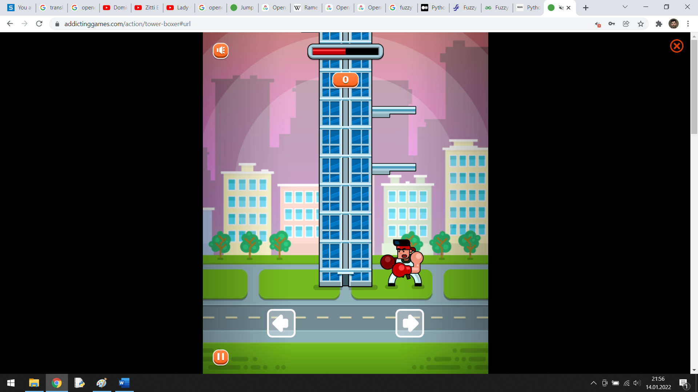
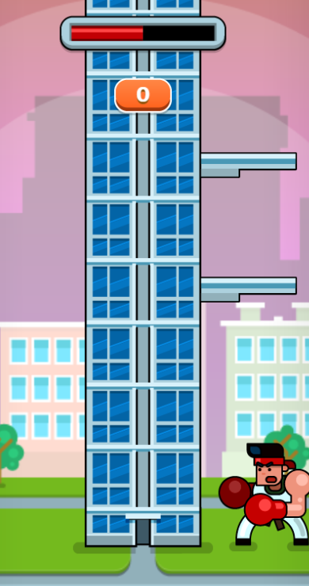
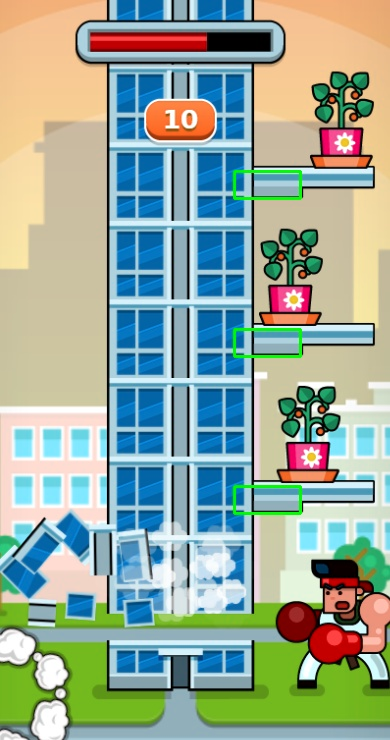

# Tower Boxer Game Bot with OpenCV Python

## Giriş  
Bu projede www.addictinggames.com sitesindeki Tower Boxer oyununu oynayan bir algoritma geliştirildi. Yazılım oyundan veri almak için oyunun ekran görüntüsü üzerinde görüntü işleme yapar ve klavye fonksiyonlarını taklit ederek oyuna girdi gönderir. Yazılım oyunu oynamak için oyunun kaynak kodlarına erişmeye gerek duymaz. Dışarıdan gerçek bir oyuncunun oynadığı gibi oyun ile etkileşime geçer.
Oyunun Linki: https://www.addictinggames.com/action/tower-boxer

## Kodu Kendi Bilgisayarınızda Çalıştırabilmeniz İçin  
Yazılımı çalıştırdıktan sonra esc tuşuna basarak kapatabilirsiniz. Oyun esnasında yazılım sürekli sağ veya sol ok tuşlarına basacağı için yazılımı kapatmak istediğinizde esc kısayolunu kullanmak kolaylık sağlayacaktır.

Yazılımın bilgisayarınızda çalışabilmesi için aşağıdaki kütüphanelerin yüklü olması gerekmektedir.   
opencv  
numpy  
keyboard  
pillow  
mss  
pywin32  

Bu yazılım Windows ortamında geliştirilip test edildi. Diğer ortamlarda test edilmedi. Klavye fonksiyonları Windows'a göre yapıldı. Diğer işletim sistemlerinde çalıştırmak isterseniz klavye işlemlerini uyarlamanız muhtemelen yeterli olacaktır.

Bu projede ekran görüntüsü alınmakta ve bu ekran görüntüsü üzerinde işlem yapılmaktadır. Dolayısıyla sizin ekranınızın çözünürlüğü, oyunun ekran üzerindeki konumu ve oyun penceresinin boyutu gibi etkenler değişiklik göstereceği için yazılım yüksek ihtimalle ilk seferde bilgisayarınızda düzgün çalışmayacaktır. Öncelikle yazılımı kendi ekranınıza göre uyarlamanız gerekmektedir. Bunun için game_region yapısını, engel_sag.png ve engel_sol.png fotoğraflarını, boksor_y_loc değişkenini ve distance_tresh değişkenini kendi ekranınıza göre uyarlamalısınız. Ayrıntılı bilgi Kod Açıklamalarında verildi.

Runtime Broker hakkında:  
Ayarlamaları yaptınız ve yazılım düzgün bir şekilde çalıştı. Ancak kapatıp tekrar çalıştırdığınızda bu sefer düzgün çalışmayabilir. Bunun nedeni Windows'taki Runtime Broker özelliğidir. Algoritma sağ veya sol ok tuşlarına çok hızlı bir şekilde bastığı için Runtime Broker bunu zararlı bir şey olarak algılayıp engelleyebilir. Böyle bir şey olduğunu hissettiğinizde görev yöneticisinden Runtime Broker görevlerini sonlandırabilirsiniz.

## Kod Açıklamaları  
Algoritma genel olarak şu şekilde çalışmaktadır. Oyunun ekran görüntüsünü alır. Bu ekran görüntüsü içerisinde engelleri arar. Eğer karakter sağ tarafta ise sadece sağ taraftaki engelleri arar. Eğer karakter sol tarafta ise sadece sol taraftaki engelleri arar. Karaktere belirli bir mesafeden daha yakında engel varsa bulunduğu konumun ters tarafındaki butona basar. Eğer karaktere yakın engel yok ise bulunduğu tarafın butonuna basar.  

Satır 13-14: Klavye üzerindeki sağ ve sol ok tuşlarının adresleri tanımlandı. Bu tuşlara basılması gerektiğinde press_button fonksiyonu çağırılacak ve istenen tuşun adresi fonksiyona parametre olarak verilecek. Klavye işlemleri için win32api kullanıldı. Ayrıntılı bilgi için Satır 8 ve 9'daki linkleri inceleyebilirsiniz.

Satır 17-18: Çalışmaların yapıldığı ekranın çözünürlüğü. Kod içerisinde doğrudan kullanılmıyorlar ama hesaplama yapılırken kullanıcı tarafından göz önünde bulundurulması gereken değerler olduğu için buraya koyuldu. Siz burayı kendi ekran çözünürlüğünüz ile değiştirebilirsiniz.  

Satır 20-29: Yazılım oyunu oynarken tüm ekran görüntüsüne bakmıyor. Sadece ekran üzerindeki belirli bir bölgenin görüntüsüne bakıyor. Bu bölgenin piksel koordinatları burada tanımlandı ve en son game_region isimli yapı içerisine kaydedildi. Çalışmanın yapıldığı ekranın tam görüntüsü ve ekran içinde yazılımın baktığı bölgenin görüntüsü aşağıda verildi. Bu iki görseli referans alarak bu bölgedeki değişkenleri kendi ekranınıza göre düzenleyebilirsiniz.  

### Tam ekran görüntüsü:  
  

### Bakılan bölge (oyun bölgesi):  
  

take_ss fonksiyonu: Bu fonksiyon kendisine verilen bölgenin ekran görüntüsünü RGB formatında alır ve bunu bir numpy dizisine kaydedip döndürür. 

find_object fonksiyonu: Bu fonksiyon içerisinde openCV template matching yöntemi kullanılır. Oyun görseli içerisinde engelleri aramak amacıyla kullanılmaktadır. Engellerin fotoğrafları kodun ilerleyen kısımlarında verildi. Bu fonksiyon %93'ten daha yüksek eşleşme oranına sahip olan tüm bölgelerin y ve x koordinatlarını döndürmektedir.  

press_button fonksiyonu: İstenilen butona basılması için kullanılan fonksiyon. Bu fonksiyon içerisinde win32api'nin fonksiyonları kullanıldı. Bu işlem için farklı alternatifler de mevcut. pydirectinput, keyboard ve pynput gibi. Ancak bu kütüphanelerin fonksiyonlarında genel olarak 100 ms civarı dahili gecikme bulunuyordu. Bu algoritmada hız önemli olduğu için bu kütüphaneler tercih edilmedi.  

Satır 59-67: esc tuşuna basıldığında yazılımın sonlandırılması için bir yapı oluşturuldu. esc tuşuna basıldığında exit fonksiyonu çalışıyor ve run değişkeni 0'a eşitleniyor. while döngüsü run değişkenine bağlı olduğu için while döngüsü sonlanıyor. 

boksor_loc değişkeni: boksorün kuleye göre konumu. 0 ise sol, 1 ise sağda demek. Başlangıçta hep sağda olduğu için başlangıç değeri 1 verildi.  

boksor_y_loc değişkeni: Boksörün en üst noktasının bakılan oyun görseli içerisindeki y ekseni koordinatı. Boksör ile engeller arasındaki mesafe hesaplanırken kullanılacak. Bu değişkeni kendinize göre uyarlamak için ekran görüntüsü alıp bunu paint ile açtıktan sonra kalemi görsel üzerinde gezdirirken sol alt köşede x, y koordinatlarını görebilirsiniz. Bu görsel üzerinde yazılımın baktığı bölgeyi seçip kırptıktan sonra kırpılmış görsel üzerinden istediğiniz noktanın y ekseni koordinatını bulabilirsiniz.

Satır 78-82: Oyun görselinde aranacak olan engellerin fotoğrafları burada yazılıma yükleniyor. opencv imread fonksiyonu fotoğrafları yüklerken BGR formatında yüklüyor. Oyunun ekran görüntüsü RGB formatında alındığı için engellerin fotoğrafları da burada RGB formatına dönüştürülüyor. Bu iki görsel çalışmaların yapıldığı ekran üzerinde oyun görselinden kırpıldı. Siz bu fotoğrafları kendi ekranınızda tekrardan aynı şekilde oluşturursanız daha sağlıklı olacaktır.

distance_tresh değişkeni: Boksörün üst noktası ile en alttaki engel arasında ne kadar mesafe olursa boksörün diğer tarafa geçmesi gerektiğini belirleyen değişken. Siz bu değişkeni kendi ekran çözünürlüğünüze göre uyarlamalısınız. Eğer ekran çözünürlüğünüz daha düşük ise bu değişken azalmalı. Eğer daha yüksek ise bu değişken artmalı.

while döngüsünde öncelikle oyun bölgesinin ekran görüntüsü alınır. Ardından boksör hangi tarafta ise o taraftaki engeller template matching yöntemi ile bulunur. Bunun için oyun görüntüsü içerisinde engelin fotoğrafı aranır. Sağ ve sol bölgeler için engel fotoğrafları aşağıda verilmiştir.

### Sol engel parçası:  
  

### Sağ engel parçası:  
  

Ekranda birden fazla engel olabilir. Bu durumda bu engellerin hepsi bulunur. Aşağıdaki görselde bulunan engeller yeşil dikdörtgen içine alınarak gösterilmiştir.

### Engel bulma:  
  

Bulunan tüm engellerin y ekseni konumu ile boksörün y ekseni konumu karşılaştırılır ve aradaki mesafe belirli bir değerden daha küçük ise boksörün diğer tarafa geçmesi sağlanır. Eğer tüm engeller boksöre uzaksa o zaman boksörün aynı tarafta kalmasını sağlayacak butona basılır.

## Tanıtım Videosu  
<!--  

-->
https://youtu.be/LMXFIlBQ0YM

